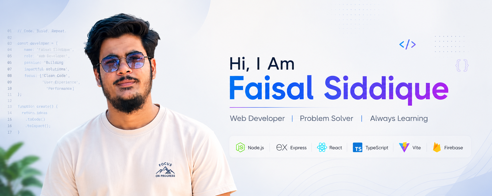

```md
<div align="center">
  
</div>

<br/>

<div align="center">

<a href="mailto:faisalsiddique.129@gmail.com">

</a>

<a href="https://linkedin.com/in/muhammad-faisal-74baa5297">

</a>

<a href="https://github.com/FaisalSidd123">

</a>

<a href="https://faisal-siddique.vercel.app">

</a>


</div>

---

## 🚀 About Me

Computer Science undergraduate at **NED University of Engineering & Technology, Karachi** with a passion for building scalable applications and solving real-world problems through technology.

- 🔭 Currently developing an **Enterprise Automobile Management System**
- 🤖 Exploring **AI-powered applications, LLaMA, and NVIDIA NIM**
- 🌱 Continuously learning modern software architecture and system design
- 💬 Open to discussions about **React, Next.js, Node.js, TypeScript, and AI**
- ⚡ Focused on writing clean, maintainable, and production-ready code

---

## 💻 Tech Stack

### Languages


### Frontend


### Backend


### Databases


### Tools & Platforms


---

## 💼 Experience

### Full Stack Developer — TribeSell
**Apr 2026 – Present**

- Developing a management system for a Japanese automobile organization
- Implementing RBAC, workflow automation, and document management
- Building email notification and approval systems

### Full Stack Developer & Brand Associate — Phantom Gambit
**Jun 2025 – Present**

- Developed company website with modern UI/UX
- Maintained design systems and branding assets
- Collaborated with the game development team

### Web Development Intern — Barrett Hodgson
**Mar 2025 – Apr 2025**

- Built enterprise forms using React, Node.js, and MySQL
- Developed approval and notification workflows
- Worked on production-level business applications

---

## 🌟 Featured Projects

### 📖 QuranVision
A full-stack Islamic platform featuring Quran, Hadith, Learning Plans, Islamic Store, and Authentication.

**Tech:** React • Firebase • Node.js

### 🤖 MYP CRM
AI-powered CRM platform with contact management, Kanban boards, and intelligent contact parsing.

**Tech:** Next.js • LLaMA 3.1

### 💬 Anonymous Messaging Platform
Anonymous messaging application powered by AI-generated suggestions.

**Tech:** Next.js • MongoDB • NVIDIA NIM

### 🛒 Dream Fragrance
Full-stack e-commerce platform with product management, order processing, and admin dashboard.

**Tech:** React • Firebase

---

## 📊 GitHub Analytics

<div align="center">


<br/>


</div>

---

## 🏆 Highlights

- ✅ Production-ready Full Stack Applications
- 🤖 AI Integrations using LLaMA 3.1 & NVIDIA NIM
- 🏢 Enterprise Software Development Experience
- 📜 Full Stack Web Development Certification
- 🎨 UI/UX Design & Brand Development Experience

---

<div align="center">

### 🤝 Let's Connect

Building modern web applications, enterprise solutions, and AI-powered products.

📩 **faisalsiddique.129@gmail.com**

</div>
```
